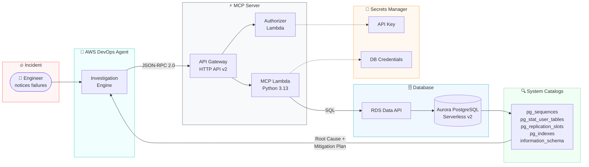
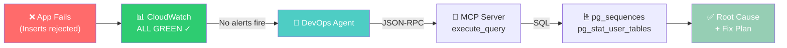

# Database Incident Investigation with AWS DevOps Agent

> **This is sample code, for non-production usage.** You should work with your
> security and legal teams to meet your organizational security, regulatory and
> compliance requirements before deployment.
>
> This project intentionally ships some patterns that are convenient for a demo
> but are **not** appropriate for production. See
> [Security Considerations](#security-considerations) for each such pattern and
> its production alternative.

Automatically detect, investigate, and diagnose in-database failures on Amazon Aurora PostgreSQL using AWS DevOps Agent with custom MCP servers — where CloudWatch metrics stay green and only live SQL introspection reveals the root cause.

## Overview

When a database-backed application fails, on-call engineers check CloudWatch dashboards and find everything green. The real problem lives inside the database — in system catalogs, sequences, statistics, and replication state — invisible to traditional monitoring. This demo deploys an Aurora PostgreSQL cluster, wires it to AWS DevOps Agent via a custom MCP server, and lets you inject real database failures to watch the agent diagnose them automatically.

The MCP server bridges the gap between metric-based observability and in-database state, giving DevOps Agent the ability to run live SQL against PostgreSQL system catalogs during investigations.

## At a Glance

| | |
|---|---|
| **Duration** | ~15 min deployment + ~5 min per scenario |
| **Difficulty** | Intermediate |
| **Target Audience** | DBAs, SREs, DevOps Engineers, Solutions Architects |
| **Key Technologies** | Amazon Aurora PostgreSQL, AWS DevOps Agent, MCP (Model Context Protocol), Lambda, API Gateway, RDS Data API |
| **Estimated Cost** | ~$2–5/day while running (Serverless v2 at minimum ACU) |
| **AWS Regions** | us-east-1 (DevOps Agent supported region) |

## DevOps Agent Features Demonstrated

| Feature | How it's demonstrated |
|---------|----------------------|
| **On-demand Investigation** | Inject a DB fault → manually trigger investigation → agent diagnoses via MCP |
| **Custom MCP Server** | Purpose-built MCP server queries PostgreSQL system catalogs in real time |
| **Root Cause Analysis** | Agent identifies schema/catalog-level issues invisible to CloudWatch |
| **Mitigation Planning** | Agent produces step-by-step remediation with rollback plan |
| **Tool Orchestration** | Agent chains `list_clusters` → `describe_table` → `execute_query` to reach diagnosis |

## Why CloudWatch Isn't Enough

| CloudWatch / RDS metrics **CAN** see | **ONLY** the MCP server can reveal (via SQL) |
|---|---|
| CPU, memory, ACU capacity, IOPS | Schema & DDL — column types, indexes, constraints |
| Database connections count & limits | Sequence values and how close they are to overflow |
| Aggregate wait events, top SQL by load | Dead tuples, table/index bloat, last (auto)vacuum |
| Replica lag, deadlock counts | Logical replication slot state & retained WAL |
| That a query is slow (latency) | *Why* it is slow — EXPLAIN plan & stale statistics |

## Architecture



### Investigation Flow (Simplified)



**Flow:**
1. Engineer notices application INSERT failures
2. CloudWatch metrics are all green — no alerts fire
3. Engineer asks DevOps Agent to investigate
4. Agent calls MCP server tools (`list_clusters`, `execute_query`, etc.)
5. MCP Lambda queries PostgreSQL system catalogs via RDS Data API
6. Agent identifies root cause and produces mitigation plan

## Prerequisites

- AWS CLI v2 configured with credentials and default region
- An AWS account with permissions for CloudFormation, RDS, Lambda, API Gateway, IAM, Secrets Manager
- A VPC with at least 2 subnets in different AZs

## Quick Start

### 1. Clone the repository

```bash
git clone https://github.com/aws-samples/sample-devops-agent-aurora-db.git
cd sample-devops-agent-aurora-db
```

### 2. Deploy the Aurora PostgreSQL cluster

The master password is **generated automatically** and stored in AWS Secrets
Manager (`/<environment>/postgres-mcp-server/db-credentials`). You do not supply
it. The cluster reads it via a `{{resolve:secretsmanager:...}}` dynamic
reference, so the password never appears in CLI arguments or stack events.

```bash
aws cloudformation create-stack \
  --stack-name aurora-postgres-cluster \
  --template-body file://cloudformation/aurora-postgresql-cluster.yaml \
  --parameters \
    ParameterKey=Environment,ParameterValue=demo \
    ParameterKey=VpcId,ParameterValue=<your-vpc-id> \
    ParameterKey=SubnetId1,ParameterValue=<subnet-az1> \
    ParameterKey=SubnetId2,ParameterValue=<subnet-az2> \
  --capabilities CAPABILITY_NAMED_IAM \
  --region us-east-1

aws cloudformation wait stack-create-complete --stack-name aurora-postgres-cluster
```

### 3. Deploy the MCP server

The MCP server stack consumes the generated master secret **by ARN** (from the
cluster stack output `MasterDBCredentialsSecretArn`) rather than receiving a
password. The public MCP endpoint defaults to **read-only**
(`AllowWriteQueries=false`); the demo's schema setup and scenario injection run
SQL directly via the RDS Data API, so the endpoint does not need write access.

```bash
MASTER_SECRET_ARN=$(aws cloudformation describe-stacks \
  --stack-name aurora-postgres-cluster \
  --query "Stacks[0].Outputs[?OutputKey=='MasterDBCredentialsSecretArn'].OutputValue" \
  --output text --region us-east-1)

aws cloudformation create-stack \
  --stack-name aurora-mcp-server \
  --template-body file://cloudformation/aurora-postgresql-mcp-server.yaml \
  --parameters \
    ParameterKey=Environment,ParameterValue=demo \
    ParameterKey=MasterDBCredentialsSecretArn,ParameterValue="$MASTER_SECRET_ARN" \
    ParameterKey=AllowWriteQueries,ParameterValue=false \
  --capabilities CAPABILITY_NAMED_IAM \
  --region us-east-1

aws cloudformation wait stack-create-complete --stack-name aurora-mcp-server
```

The MCP server stack also creates a **least-privilege application secret**
(`/<environment>/postgres-mcp-server/app-db-credentials`) and turns on
**automatic API key rotation** (see [Security](#security-hardening) below).

### 3a. Create the least-privilege database role

The MCP endpoint authenticates as a read-only PostgreSQL role (`mcp_app` by
default), not the Aurora master user. After the MCP stack is created, run the
bootstrap script once to create that role with the generated app password and
grant it read-only privileges:

```bash
ENVIRONMENT=demo CLUSTER_ID=aurora-postgres-cluster-1 AWS_REGION=us-east-1 \
  bash scripts/setup-readonly-role.sh
```

Re-run this if you rotate the app-db-credentials secret. `bash scripts/deploy-all.sh`
performs this step for you automatically.

### 4. Register with DevOps Agent

#### Prerequisites

Before starting, ensure you have:

- **Aurora PostgreSQL MCP server deployed** — the CloudFormation stack (`aurora-postgresql-mcp-server.yaml`) is successfully created
- **MCP Endpoint URL** — available in the stack outputs 
- **API Key** — stored in Secrets Manager at `/<environment>/postgres-mcp-server/api-key`
- **AWS DevOps Agent** — access to the DevOps Agent console in a supported region (us-east-1, us-west-2, ap-southeast-2, ap-northeast-1, eu-central-1, or eu-west-1)

#### Step 1: Retrieve the MCP Endpoint URL

**From CloudFormation Console:**

1. AWS Console → **CloudFormation**
2. Select your MCP server stack
3. Go to the **Outputs** tab
4. Copy the value of **McpEndpointUrl**

#### Step 2: Retrieve the API Key

**From Secrets Manager Console:**

1. AWS Console → **Secrets Manager**
2. Find the secret: `/<environment>/postgres-mcp-server/api-key`
3. Click on the secret name
4. Scroll to the **Secret value** section
5. Click **Retrieve secret value**
6. Copy the value of the `api_key` field

> **Note on rotation:** the API key rotates automatically (default every 30 days).
> The authorizer accepts both the current and previous key, so rotation is
> non-disruptive — but you must update this registration with the new value
> before the following rotation, or the old key will stop working. See
> [Security Hardening](#security-hardening).

#### Step 3: Register the MCP Server (Account Level)

MCP servers are registered at the AWS account level and shared among all Agent Spaces.

**Via Console (Recommended):**

1. Sign in to the **AWS Management Console**
2. Navigate to the **AWS DevOps Agent** console
3. Go to **Capability Providers** (side navigation)
4. Find **MCP Server** in the Available providers section
5. Click **Register**
6. Leave **Enable Dynamic Client Registration** unchecked
7. Leave **Connect to endpoint using private connection** unchecked (unless your MCP server is on a private network)
8. Click **Next**

**Page 2: Authorization Flow**

Select **API Key**. Click **Next**.

**Page 3: Authorization Configuration**

| Field | Value |
|-------|-------|
| API Key Name | `Aurora-Postgres-MCP-Key` |
| API Key Header | `Authorization` |
| API Key Value | *(paste the value retrieved in Step 2)* |

Click **Next**.

**Page 4: Review and Submit**

1. Review all configuration details
2. Click **Submit**
3. AWS DevOps Agent will validate the connection to your MCP server
4. Wait for the status to show as registered/valid

Save the returned `serviceId` for the next steps.

#### Step 4: Create an Agent Space (if needed)

Skip this step if you want to add the MCP server to an existing Agent Space.

**Via Console:**

1. In the DevOps Agent console, click **Create Agent Space**
2. Enter a name (e.g., `Aurora-PostgreSQL-Space`)
3. Click **Create**

Save the returned `agentSpaceId`.

#### Step 5: Associate AWS Account with the Agent Space

This gives the Agent Space access to your AWS resources for investigation.

**Via Console:**

1. Select your Agent Space
2. Go to the **Capabilities** tab
3. Under **AWS Account**, click **Associate**
4. Select or create an IAM role with the necessary permissions
5. Enter your Account ID
6. Select account type: **monitor**

#### Step 6: Associate Event Channel (Optional)

Enables event-driven investigations (e.g., triggered by CloudWatch alarms).

#### Step 7: Add the MCP Server to the Agent Space

**Via Console:**

1. Select your Agent Space
2. Go to the **Capabilities** tab
3. In the **MCP Servers** section, click **Add**
4. Select `aurora-postgres-mcp-server`
5. Configure tool access — **Select specific tools** (recommended) and allowlist:
   - `list_clusters`
   - `list_databases`
   - `list_schemas`
   - `list_tables`
   - `describe_table`
   - `execute_query`
6. Or choose **Allow all tools**
7. Click **Add**

#### Step 8: Verify the Integration

**From the Console:**

1. Go to your Agent Space
2. Open the **Capabilities** tab
3. Confirm the MCP Server appears with status **Valid**

### 5. Setup the test schema

```bash
bash scripts/setup-schema.sh
```

### 6. Run a scenario

```bash
# Inject Scenario 1: Sequence Exhaustion
bash scripts/inject-scenario1.sh

# Then ask DevOps Agent:
# "Our orders service is failing on inserts with errors. All CloudWatch metrics
#  for cluster aurora-postgres-cluster-1 look normal. Can you investigate?"
```

Total deployment: ~15 minutes.

## Failure Scenarios

| # | Scenario | What breaks | What CloudWatch shows | Root cause location |
|---|----------|-------------|----------------------|---------------------|
| 1 | **Sequence Exhaustion** | All inserts fail | All green | `pg_sequence` / `pg_sequences` |
| 2 | **Table & Index Bloat** | Gradual latency increase | Gentle IOPS rise | `pg_stat_user_tables` (n_dead_tup) |
| 3 | **Missing Index / Stale Stats** | One query times out | Aggregate latency normal | `EXPLAIN`, `pg_indexes`, last_analyze |
| 4 | **Inactive Replication Slot** | Storage fills up | Free storage falling | `pg_replication_slots` (active) |

### Recommended demo order

1. **Start with Scenario 1** — most dramatic (complete write outage with green dashboards)
2. **Follow with Scenario 4** — most complex (cascading risk, WAL mechanics)

## Run the Demo

### 1. Verify the cluster is healthy

```bash
bash scripts/test-connection.sh
```

### 2. Inject a failure

```bash
bash scripts/inject-scenario1.sh
```

### 3. Show green dashboards

Open CloudWatch → RDS metrics for `aurora-postgres-cluster-1`. All metrics normal.

### 4. Ask DevOps Agent to investigate

> "Our orders service is failing on inserts with errors. All CloudWatch metrics for cluster aurora-postgres-cluster-1 look normal — CPU, connections, and IOPS are all green. Can you investigate what's wrong?"

### 5. Watch the diagnosis (~2–3 minutes)

The agent autonomously:
- Confirms cluster health via `list_clusters`
- Discovers the `orders` table via `list_tables` + `describe_table`
- Queries `pg_sequences` and finds `orders_id_seq` at 100% consumed
- Confirms `orders.id` is `integer` (int4, max 2,147,483,647)
- Delivers root cause + mitigation plan

### 6. Reset

```bash
bash scripts/reset-scenario1.sh
```

## Project Structure

```
├── README.md
├── CONTRIBUTING.md
├── LICENSE
├── cloudformation/
│   ├── aurora-postgresql-cluster.yaml       # Aurora PostgreSQL Serverless v2 cluster
│   ├── aurora-postgresql-mcp-server.yaml    # MCP server (Lambda + API Gateway)
│   └── devops-agent-integration.yaml        # DevOps Agent space + MCP registration
├── scripts/
│   ├── deploy-all.sh                        # One-command deployment
│   ├── setup-schema.sh                      # Create test tables and seed data
│   ├── test-connection.sh                   # Verify MCP server connectivity
│   ├── inject-scenario1.sh                  # Trigger: Sequence exhaustion
│   ├── inject-scenario2.sh                  # Trigger: Table bloat
│   ├── inject-scenario3.sh                  # Trigger: Missing index / stale stats
│   ├── inject-scenario4.sh                  # Trigger: Inactive replication slot
│   ├── reset-scenario1.sh                   # Reset scenario 1
│   ├── reset-all.sh                         # Reset all scenarios
│   ├── setup-readonly-role.sh               # Create the least-privilege MCP DB role
│   └── cleanup.sh                           # Delete all resources
└── docs/
    └── THREAT_MODEL.md                      # STRIDE threat model and remediation record
```

## MCP Server Tools

| Tool | Description | Arguments |
|------|-------------|-----------|
| `list_clusters` | List all Aurora PostgreSQL clusters | (none) |
| `list_databases` | List databases in a cluster | cluster_identifier, database |
| `list_schemas` | List schemas in a database | cluster_identifier, database |
| `list_tables` | List tables in a schema | cluster_identifier, database, schema_name |
| `describe_table` | Show column definitions | cluster_identifier, database, table_name |
| `execute_query` | Run a SQL query via Data API | cluster_identifier, database, sql |

## Cost Estimate

| Resource | Monthly (approx.) |
|----------|-------------------|
| Aurora Serverless v2 (0.5 ACU min) | ~$45 |
| Lambda (MCP + Authorizer) | < $1 |
| API Gateway | < $1 |
| Secrets Manager (3 secrets) | $1.20 |
| DevOps Agent (investigation hours) | ~$5 (demo usage) |
| **Total** | **~$2–5/day** |

**Cost optimization:** Tear down when not in use with `bash scripts/cleanup.sh`.

## Troubleshooting

**Custom stack names.** The helper scripts default to the stack name
`aurora-mcp-server` and cluster id `aurora-postgres-cluster-1`. If you deployed
the stacks under different names (for example via the console), export these
before running any script so they resolve the right resources:

```bash
export AWS_REGION=us-east-1
export MCP_STACK_NAME=<your-mcp-server-stack-name>
export CLUSTER_ID=<your-cluster-identifier>
export ENVIRONMENT=demo
```

`setup-schema.sh`, `setup-readonly-role.sh`, `test-connection.sh`, and all the
`inject-*` / `reset-*` scripts honor these variables.

**`relation "..." does not exist` when injecting a scenario.** The scenario
scripts operate on the `orders` / `order_events` tables. Run
`bash scripts/setup-schema.sh` first — the tables (and the `orders_id_seq`
sequence) must exist before any scenario can be injected.

**`Cannot find version 16.x for aurora-postgresql`.** Aurora deprecates minor
versions over time. List what's currently available and pass a valid value via
the `EngineVersion` parameter:

```bash
aws rds describe-db-engine-versions --engine aurora-postgresql \
  --query "DBEngineVersions[].EngineVersion" --output text --region us-east-1 \
  | tr '\t' '\n' | sort -V
```

**`... already exists` on redeploy (subnet group, security group, cluster,
IAM role, MCP service).** A failed stack can leave resources behind, or a prior
run may already own that name. Delete the failed stack first
(`aws cloudformation delete-stack ...`). For a DevOps Agent MCP **service** that
is stuck, it must be disassociated from every agent space before it can be
deregistered: use `aws devops-agent list-associations --agent-space-id <id>` to
find the association id, `disassociate-service --association-id <id>`, then
`deregister-service --service-id <id>`. Deleting an agent space
(`delete-agent-space`) cascades and removes its associations (and any service
the space uniquely held) for you.

**DevOps Agent registration fails schema validation.** The
`AWS::DevOpsAgent::Service` / `Association` resources use the property key
`MCPServer` (uppercase MCP), not `McpServer`.

## Cleanup

```bash
bash scripts/cleanup.sh
```

Deletes all resources in reverse dependency order: DevOps Agent registration, MCP server stack, Aurora cluster stack, and any leftover secrets.

## Contributing

We welcome community contributions! Please see [CONTRIBUTING.md](CONTRIBUTING.md) for guidelines.

## Security Considerations

This is sample code. To keep the demo self-contained it knowingly ships a few
patterns that are weaker than what you should run in production. Each is called
out here with the production alternative you should adopt. Work with your own
security and legal teams before deploying any of this.

| Sample pattern (as shipped) | Why it's convenient here | Production alternative |
|---|---|---|
| **Shared bearer API key** on a public HTTPS endpoint — one static key (auto-rotated, dual-key) guards `/mcp` for all callers. | One credential to paste into the DevOps Agent registration; no per-caller identity plumbing. | **Per-caller identity**: put the endpoint behind IAM authorization (SigV4) or **AWS PrivateLink**/an interface VPC endpoint so it is not internet-facing, and restrict source to the agent's known egress (IP allowlist) if knowable. Remove the shared bearer key. |
| **Master database user path exists** — operator scripts (`setup-schema.sh`, `inject-*`, `reset-*`) run privileged DML using the generated *master* secret via the Data API. | The demo needs to create tables and inject fault scenarios quickly. | The **public endpoint already uses a SELECT-only role** (`mcp_app`), never the master user. In production, run any required write/DDL through a scoped migration role in CI/CD, not ad-hoc scripts, and keep the master secret out of all runtime paths. |
| **Broad-ish network default** — `AllowedCidr` defaults to the private `10.0.0.0/8` range and `0.0.0.0/0` is an *offered* value; `PubliclyAccessible` defaults to `false`. | Lets the demo connect from anywhere inside a typical VPC without per-environment tuning. | Scope the security group to a **specific application security group or a narrow VPC CIDR**, never `0.0.0.0/0`. Keep `PubliclyAccessible=false`. Prefer VPC endpoints / PrivateLink for private access. |
| **WAF WebACL defined but not associated** — AWS WAF cannot attach to an API Gateway **HTTP API (v2)**, so the WebACL ships unassociated. | Keeps the demo to a single HTTP API without a CloudFront layer. | Front the HTTP API with a **CloudFront distribution** (WebACL `Scope: CLOUDFRONT`) and associate the WebACL there, or use a REST API which WAF supports directly. |
| **Verbose demo defaults** — an internet-facing endpoint, generous Lambda timeout, and a permissive read surface (`execute_query` can read anything the role can `SELECT`). | Makes the investigation scenarios easy to run and observe. | Constrain the tool surface to only the catalogs the agent needs, enable **API Gateway access logging** (excluding the `Authorization` header), and review the read scope against your data-classification rules. |

Where a sample cannot reasonably carry the production pattern, this section **is**
the mitigation — treat it as required reading before any real deployment.

## Security Hardening

The controls below are what the sample **does** apply (defense-in-depth around
the public MCP endpoint and the database it can reach). This is distinct from the
[Security Considerations](#security-considerations) above, which lists the
tradeoffs the sample knowingly makes.

**Secrets are generated, never passed as plaintext**
- The Aurora **master password** is generated by Secrets Manager in the cluster
  stack and read by the cluster via a `{{resolve:secretsmanager:...}}` dynamic
  reference. It is never a CloudFormation/CLI parameter.
- The **MCP API key** is generated in Secrets Manager. The DevOps Agent
  integration template resolves it dynamically (`McpApiKeySecretArn`) rather than
  taking a plaintext value.
- Three secrets are created: master DB credentials, the least-privilege app DB
  credentials, and the API key.

**Least-privilege database access**
- The public MCP endpoint authenticates as a dedicated **read-only role**
  (`mcp_app`), created by `scripts/setup-readonly-role.sh`. It holds only
  `CONNECT`/`USAGE`/`SELECT` — no writes, no DDL. The master credentials are not
  reachable from the endpoint's Lambda role.
- `execute_query` is read-only by default. When writes are disabled, queries run
  inside a `SET TRANSACTION READ ONLY` transaction, so the database itself rejects
  writes regardless of how the SQL is constructed. A `statement_timeout` bounds
  query cost.

**Endpoint protection**
- The API stage has request throttling (`ApiThrottleRateLimit` /
  `ApiThrottleBurstLimit`) to bound abuse and brute-force attempts.
- The API-key authorizer uses a constant-time comparison and accepts a `Bearer`
  scheme.
- A **WAF WebACL** (per-IP rate limiting plus AWS managed Common and
  Known-Bad-Inputs rule sets) is defined in the MCP server stack, but note that
  AWS WAF **cannot** attach directly to an API Gateway **HTTP API (v2)** — it
  only supports REST APIs, CloudFront, ALB, and a few other resource types. The
  WebACL is therefore left unassociated. To actually enforce it, front the HTTP
  API with a CloudFront distribution (WebACL `Scope: CLOUDFRONT`) and associate
  the WebACL with that distribution. Until then, the endpoint relies on the
  stage throttling and the Lambda authorizer above.

**Automatic API key rotation (no downtime)**
- Secrets Manager rotates the API key on a schedule (`ApiKeyRotationDays`,
  default 30). The authorizer accepts **both the current and previous** key, so a
  rotation never locks out clients.
- Action required: after each rotation, update the DevOps Agent registration with
  the new key value (from the `api-key` secret) **before the next rotation**, or
  the previous key ages out. Set `EnableApiKeyRotation=false` to disable.

**Least-privilege IAM/KMS**
- Lambda RDS Data API permissions are scoped to the single configured cluster,
  and KMS decrypt permissions are scoped to the specific customer-managed key.

To report a security issue, see
[CONTRIBUTING](CONTRIBUTING.md#security-issue-notifications).

## License

This library is licensed under the MIT-0 License. See the [LICENSE](LICENSE) file.
